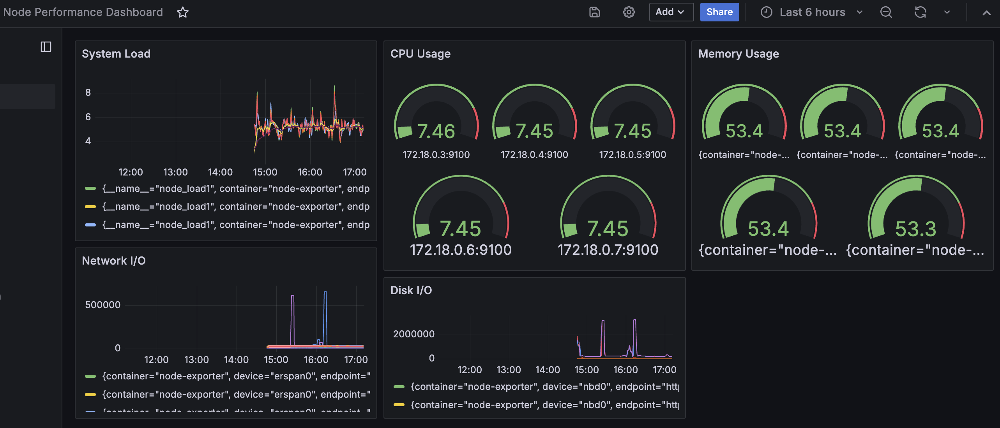

# Kubernetes 監控與自動擴展demo

## 目錄
1. [環境設置](#1-環境設置)
2. [安裝監控組件](#2-安裝監控組件)
3. [配置 Grafana](#3-配置-grafana)
4. [部署應用程序和 HPA](#4-部署應用程序和-hpa)
5. [說明](#5-說明)

## 1. 環境設置

### 1.1 安裝 kind

```bash
brew install kind
```

### 1.2 創建 kind 集群

創建 `kind-config.yaml` 

創建集群：

```bash
kind create cluster --config kind-config.yaml --name monitoring-cluster
```

## 2. 安裝監控組件

### 2.1 安裝 Helm

```bash
brew install helm
```

### 2.2 安裝 Prometheus Stack

```bash
helm repo add prometheus-community https://prometheus-community.github.io/helm-charts
helm repo update
```

創建 `prometheus-values.yaml` ：

安裝 Prometheus Stack：

```bash
kubectl create namespace prometheus
helm install prometheus prometheus-community/kube-prometheus-stack -n prometheus -f prometheus-values.yaml
```

## 3. 配置 Grafana

### 3.1 在集群外運行 Grafana

使用 Docker 運行 Grafana：

```bash
docker run -d -p 3000:3000 --name grafana grafana/grafana
```

### 3.2 配置 Prometheus data source

1. 訪問 `http://localhost:3000`
2. 使用默認的用戶名和密碼登錄（admin/admin）
3. 轉到 Configuration > Data Sources
4. 點擊 "Add data source" 並選擇 Prometheus
5. 在 URL 字段中輸入：`http://host.docker.internal:30090`
6. 點擊 "Save & Test"

### 3.3 創建儀表板

#### 3.3.1 Node Performance Dashboard

創建一個新的儀表板，增加以下視覺化面板：

1. CPU 使用率
2. 內存使用率
3. 磁盤 I/O
4. 網絡 I/O
5. 系統負載


#### 3.3.2 Cluster Performance Dashboard

創建另一個儀表板，增加以下視覺化面板：

1. Pod 數量
2. Node 數量
3. Deployment 狀態
4. PersistentVolume 使用情況
5. Namespace資源使用情況
6. CPU Throttling


## 4. 部署應用程序和 HPA

### 4.1 部署示例應用

創建 `app.yaml` 

應用此配置：

```bash
kubectl apply -f app.yaml
```

### 4.2 創建 HPA

創建 `hpa.yaml` 文件：

應用此配置：

```bash
kubectl apply -f hpa.yaml
```

## 5. 說明

### 5.1 儀表板視覺化說明

#### 5.1.1 Node Performance Dashboard

1. CPU 使用率：顯示每個節點的 CPU 使用百分比。
 - PromQL: 100 - (avg by(instance) (rate(node_cpu_seconds_total{mode="idle"}[5m])) * 100) 
2. 內存使用率：顯示每個節點的內存使用百分比。
 - PromQL: 100 * (1 - (node_memory_MemAvailable_bytes / node_memory_MemTotal_bytes))
3. 磁盤 I/O：顯示每個節點的磁盤讀寫速率。
 - 讀取 PromQL: rate(node_disk_read_bytes_total[5m])
 - 寫入 PromQL: rate(node_disk_written_bytes_total[5m])
4. 網絡 I/O：顯示每個節點的網絡進出流量。
 - 接收 PromQL: rate(node_network_receive_bytes_total[5m])
 - 傳輸 PromQL: rate(node_network_transmit_bytes_total[5m])
5. 系統負載：顯示每個節點的 1 分鐘、5 分鐘和 15 分鐘平均負載。
 - PromQL: node_load1, node_load5, node_load15



#### 5.1.2 Cluster Performance Dashboard

1. Pod 數量：顯示集群中運行的 Pod 總數。
 - PromQL: sum(kube_pod_info)
2. Node 數量：顯示集群中的節點總數。
 - PromQL: count(kube_node_info)
3. Deployment 狀態：顯示每個 Deployment 的期望副本數和實際運行的副本數。
 - 期望副本數 PromQL: kube_deployment_spec_replicas
 - 實際運行副本數 PromQL: kube_deployment_status_replicas_available
4. PersistentVolume 使用情況：顯示每個 PV 的容量和使用量。
 - 容量 PromQL: kube_persistentvolume_capacity_bytes
 - 使用量 PromQL: kubelet_volume_stats_used_bytes
5. 命名空間資源使用情況：顯示每個命名空間的 CPU 和內存使用量。
 - CPU PromQL: sum(rate(container_cpu_usage_seconds_total[5m])) by (namespace)
 - 內存 PromQL: sum(container_memory_usage_bytes) by (namespace)
6. CPU Throttling：顯示容器的 CPU 節流情況。
 - PromQL: 100 * sum(increase(container_cpu_cfs_throttled_periods_total[5m])) by (container) / sum(increase(container_cpu_cfs_periods_total[5m])) by (container)


### 5.2 觀察 CPU Throttling

要觀察 CPU Throttling 現象，可以關注指標：容器 CPU 節流百分比

```
100 * sum(increase(container_cpu_cfs_throttled_periods_total[5m])) by (container) / sum(increase(container_cpu_cfs_periods_total[5m])) by (container)
```

如果看到持續的高節流百分比，這表明容器正在經歷 CPU 限制，可能需要調整資源配置或擴展應用程序。


### 5.3 HPA 測試

要測試 HPA 的功能，可以使用以下步驟：

1. 監控 HPA 狀態：
   ```bash
   kubectl get hpa sample-app-hpa --watch
   ```

2. 在另一個終端窗口中，增加負載：
   ```bash
   kubectl run -i --tty load-generator --rm --image=busybox --restart=Never -- /bin/sh -c "while sleep 0.01; do wget -q -O- http://sample-app; done"
   ```

3. 觀察 HPA 如何根據 CPU 使用率自動擴展 Pod 的數量。

4. 停止負載生成器後，觀察 Pod 數量如何縮減回初始狀態。


